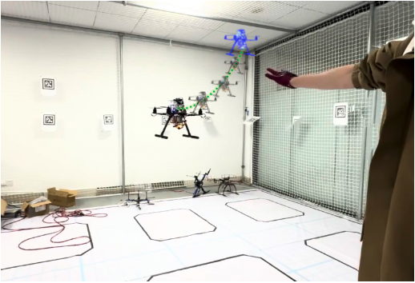

# AeroPointer

a Near field unmanned aerial vehicle interaction system

AEROPOINTER aims to control the movement of multi rotor unmanned aerial vehicles (UAVs) through human arm pointing, finger posture, and other actions, in order to directly specify the flight target, flight mode, and other functions of the UAV, bringing a new interaction method of "using the UAV as an extension of the operator's arm". Based on this, this project can be extended and developed to achieve fixed distance and direction automatic following, accompanying visual assistance, and other functions. It has great application value in certain fields and industries.

  

